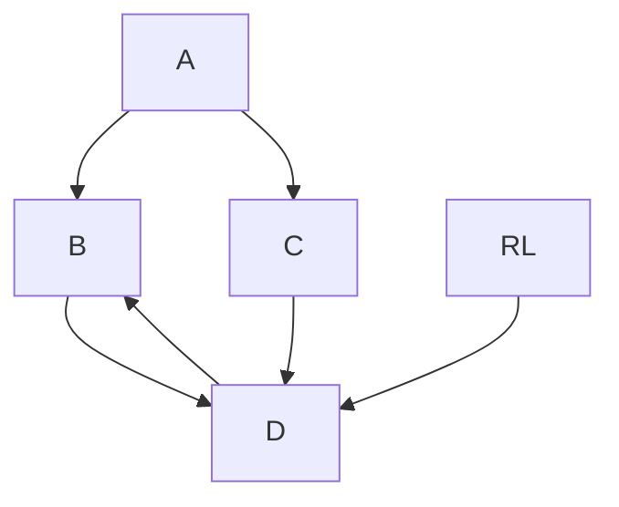
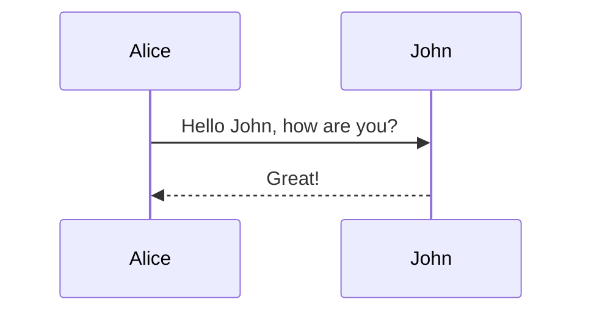
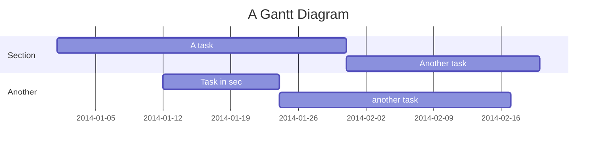

# 入口函数 
`sspShow`  **show/show.go**
[plantuml]
Alice -> Bob: Authentication Request
Bob --> Alice: Authentication Response

Alice -> Bob: Another authentication Request
Alice <-- Bob: another authentication Response<p>
[/plantuml]
```javascript
function add(x, y) {
  return x + y
}
```
```golang 
func main(a int, b int)(ret int) {
    ddd
    return abc
}
```
```Flow
A->B
B-->C
```
- [x] @mentions, #refs, [links](), **formatting**, and <del>tags</del> supported
- [x] list syntax required (any unordered or ordered list supported)
- [x] this is a complete item
- [ ] this is an incomplete item

数学公式
https://katex.org/docs/supported.html
$ s>1 $

$ \sum_{\mathclap{1\le i\le j\le n}}  x_{ij} $

${n \choose k}$


$
\begin{pmatrix}
   a & b \\
   c & d
\end{pmatrix} 
$

https://mermaidjs.github.io/flowchart.html
* TB - top bottom
* BT - bottom top
* RL - right left
* LR - left right
* TD - same as TB





```mind
-我的
 -时间管理
   -thinkido;
   -Task lists;
 -时间日志
   -日总结
   -每日成长
 -7天时间看一生
   -Task l ists;
   -time manager;
   -兼职市场
```
```mind
	-editor插件开发
		-思维导字
		-构思如何开发 3m
		-查看新插件的提交代码修改量
		-查看修改文件列表
			-比对单个文件主要修改位置
			-插件开发格式要求
		-测试 6m
```

```plantuml
<p>
[plantuml]<p>
Alice -> Bob: Authentication Request
Bob --> Alice: Authentication Response

Alice -> Bob: Another authentication Request
Alice <-- Bob: another authentication Response
<p>
[/plantuml]
```